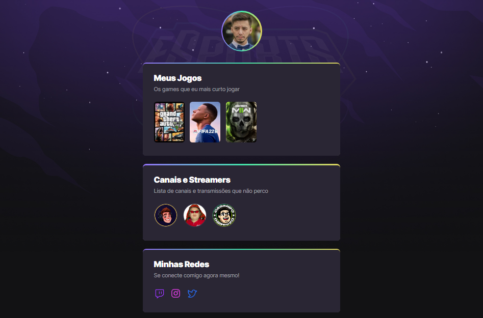

# NLW eSports 
> TRILHA  EXPLORER

Projeto construído no evento Next Level Week da Rocketseat.

[Clique aqui para acessar](https://lucasoliv27.github.io/nlw-esports)

## tecnologias
- HTML
- CSS
- GIT
- GITHUB

## O QUE EU APRENDI
Aprendi a estruturar o html de forma sêmantica, a estilizar a página usando o CSS e como salvar o projeto no repositório usando git e github.

## Contato
lucasizidoro27@gmail.com